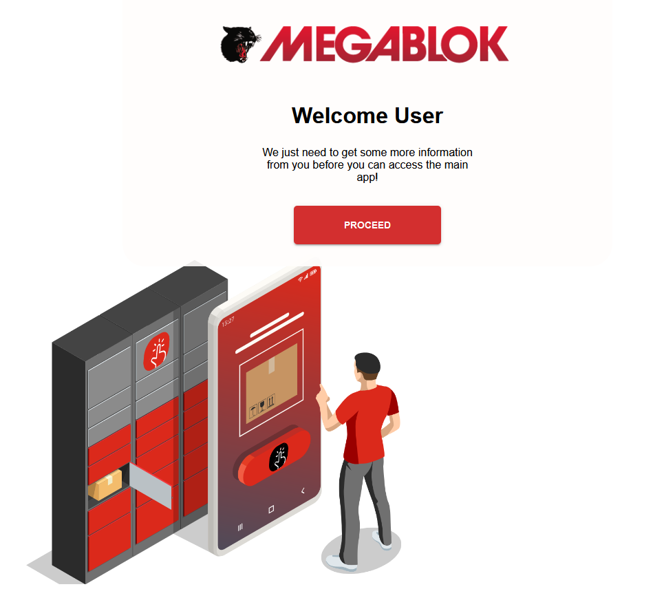

# MEGABLOK Start-up App

This App mimics a user sign-up sequence for Megablok's app, where the User must first input their product serial number, which will then lead to a User-Friendly Welcome Screen. After proceeding from the Welcome Screen, the app will make a fake get request to gather wifi networks with their strengh signals, and then the user must select a network and type in a password in order to proceed to the main-page.

## **Preview**
## 

### Built With

* 
* 

Tools Used: 
* 

APIs Used: 
* 

## :wrench: **Tech used in this project**
Front-End: Angular with [Angular Material](https://material.angular.io/) is used for the front-end UI Components. 

Serial Entry-Screen: Angular Reactive Form is used to get the serial number. Reactive Form's validate function is used to require the user to input a serial number of at least 8 characters. Upon clicking the "Submit" button the Application calls a fakeAPI using Angular's HttpClient Module that retrieves a CheckLicense.json. The CheckLicense.json returns a valid of true, 
and then the serial number is stored in Local Storage. If the user attempts to enter this initial page again, they will not be allowed to as the app redirects to the Welcome page if a serial number is able to be retrieved from localStorage.

Wifi-Networks Page: Upon initialization of the Component, a fakeApi is called that gets a Network.JSON object of available Networks with their SSID and signal strengths. As a user highlights the Accordion Menu on the right, A Child component of wifi-password-input retrieves a single network through Angular's @Input Decorator. THE SSID value is set in the child component, and with the User's input, Angular's reactive forms retrieves the wifi password from the user.
A fake call is made to the setWifi endpoint with the SSID and password being passed as Query Params. This then retrieves an object with a valid value of true. Once the valid value is read, the app navigates to the main-app page and the query params are also set in local storage as 'ssid' and 'wifiPassword'

Main-app Page: This page is essentially blank, but the user may only be able to access this page if a 'ssid' and 'wifiPassword' are found in local storage. Otherwise, the app redirects to the introductory page, which may or may not redirect to the welcome page (depending on if local storage has a serial value). Angular's Authorization guard with the CanActivate method is used on welcome-page link to allow or redirect the user to the initial page.

Styling: Angular Material's Theme is customized with a theme.scss that updates Material's three main theme colors of "primary", "accent", and "warn". Breakpoints are handled with a breakpoint Service that invokes the breakpoint Observer.

 -  serialUrl: 'https://raw.githubusercontent.com/lbernalsierra/FakeAPI/main/CheckLicense.json',
 -  networksUrl: 'https://raw.githubusercontent.com/lbernalsierra/FakeAPI/main/Networks.json',
 -  setWifiUrl: 'https://raw.githubusercontent.com/lbernalsierra/FakeAPI/main/SetWifi.json',

## Development server

Run `ng serve` for a dev server. Navigate to `http://localhost:4200/`. The application will automatically reload if you change any of the source files.

## Code scaffolding

Run `ng generate component component-name` to generate a new component. You can also use `ng generate directive|pipe|service|class|guard|interface|enum|module`.

## Build

Run `ng build` to build the project. The build artifacts will be stored in the `dist/` directory.

## Running unit tests

Run `ng test` to execute the unit tests via [Karma](https://karma-runner.github.io).

## Running end-to-end tests

Run `ng e2e` to execute the end-to-end tests via a platform of your choice. To use this command, you need to first add a package that implements end-to-end testing capabilities.

## Further help

To get more help on the Angular CLI use `ng help` or go check out the [Angular CLI Overview and Command Reference](https://angular.io/cli) page.
